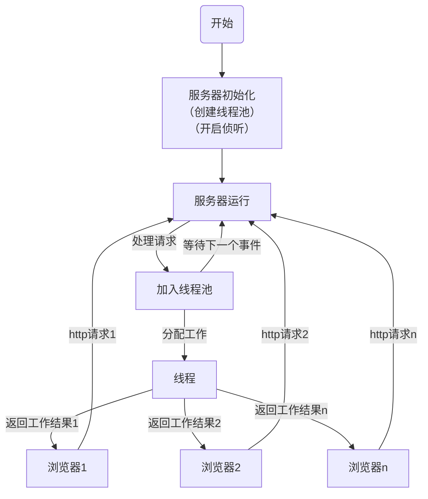

# Httpd
## 简易的服务器主程序/Tiny Httpd  
用 C++ 复现了 J.David Blackstone 的 tinyhttpd，封装了 Server 服务器类。  
在 Server 内部加入了基于生产者-消费者原理的线程池，减小了服务器运行时线程切换上下文的开销。  
当有请求到达服务器时，请求将被加入线程池的工作队列。工作者线程从工作队列中取出任务并执行。  

#### 服务器运行逻辑

  
#### 类结构  
>Server
>>start_up ( int ) 给定端口启动服务器  
>>error_exit ( string ) 异常报错并退出  

>Thread_Pool  
>>thread_start ( ) 线程例程  
>>accept_request ( int ) 响应给定套接字描述符  
>>serve_file ( int , string ) 返回目标文件  
>>execute_cgi ( int , string , Method , string ) 运行可执行程序  
>>work_insert ( int ) 将任务加入工作队列  
>>work_remove ( ) 从工作队列中取出工作  

>Respond_Message  
>>respond ( Status , int ) HTTP响应报文
