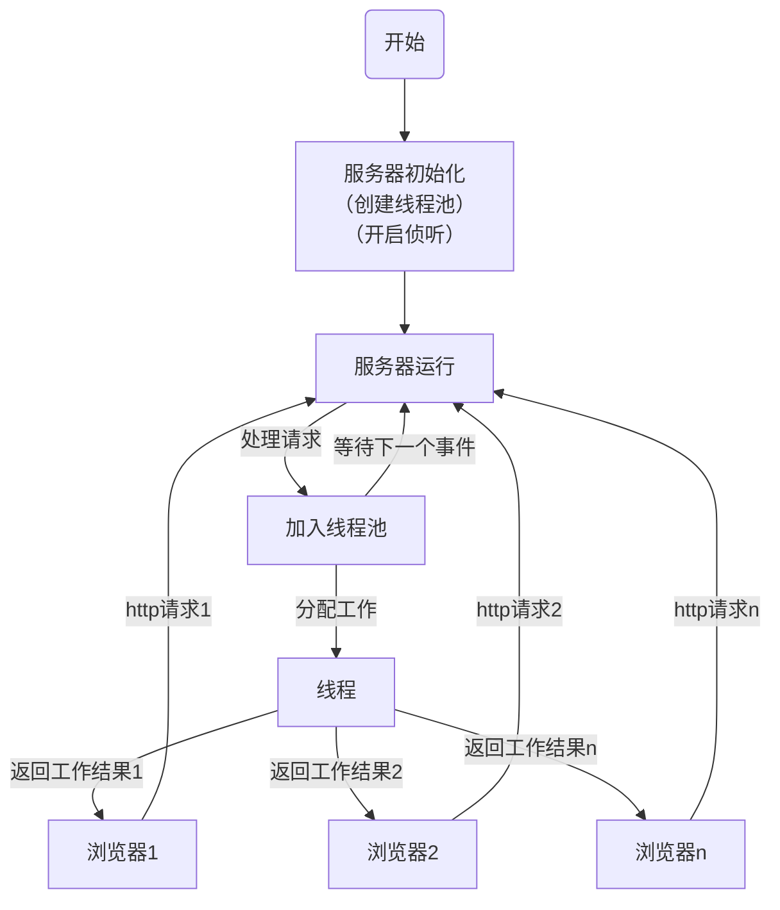

# Httpd
简易的服务器主程序/Tiny Httpd

```mermaid
graph TD
    start(开始)-->server_init[服务器初始化
    （创建线程池）
    （开启侦听）]-->server[服务器运行]
    browser1[浏览器1]
    browser1--> |http请求1| server
    server--> |处理请求| pool[加入线程池]
    pool--> |等待下一个事件| server
    pool--> |分配工作| thread_work[线程]
    thread_work--> |返回工作结果1| browser1
    browser2[浏览器2]--> |http请求2| server
    thread_work--> |返回工作结果2| browser2
    browsern[浏览器n]--> |http请求n| server
    thread_work--> |返回工作结果n| browsern
```

OK
